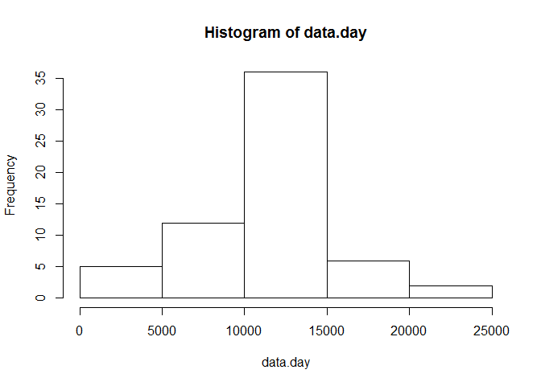

# Reproducible Research: Peer Assessment 1 --- Mikhail Ivanov


## Loading and preprocessing the data

```r
Sys.setlocale("LC_ALL","English")
library(date)
data <- read.csv(unzip("activity.zip"))
unlink("activity.csv")
data$date <- as.Date(data$date)
data$interval <- as.integer(data$interval)
data.day <- tapply(data$steps, data$date, sum, na.rm=TRUE)
data.int <- tapply(data$steps, data$interval, mean, na.rm=TRUE)
```


## What is mean total number of steps taken per day?

```r
hist(data.day)
```

<!-- -->

```r
mean(data.day)
```

```
## [1] 9354.23
```

```r
median(data.day)
```

```
## [1] 10395
```


## What is the average daily activity pattern?

```r
plot(names(data.int), data.int, type = "l", xlab = "5-minute intervals", ylab = "steps")
```

<!-- -->

```r
names(which.max(data.int))
```

```
## [1] "835"
```

## Imputing missing values

```r
sum(is.na(data))
```

```
## [1] 2304
```

Imputing the missing values with the average number of steps

```r
for( i in 1:dim(data)[1] ){
        if (is.na(data[[i, "steps"]])) data[[i, "steps"]] <-  data.int[as.character(data[[i, "interval"]])]
}
sum(is.na(data))
```

```
## [1] 0
```

```r
data.day <- tapply(data$steps, data$date, sum)
data.int <- tapply(data$steps, data$interval, mean)
hist(data.day)
```

<!-- -->

```r
mean(data.day)
```

```
## [1] 10766.19
```

```r
median(data.day)
```

```
## [1] 10766.19
```


## Are there differences in activity patterns between weekdays and weekends?

```r
data$week <- sapply(data$date, function(x){ 
        ifelse(weekdays(x) %in% c("Saturday", "Sunday"), "weekend", "weekday")
})
data.int <- tapply(data$steps, list(data$interval, data$week), mean, simplify = FALSE)
par(mfrow = c(2, 1), mar = c(2.1, 3.1, 2.1, 1.1))
plot(dimnames(data.int)[[1]], data.int[, "weekday"], type = "l", main ="weekday", xlab = "", ylab = "")
plot(dimnames(data.int)[[1]], data.int[, "weekend"], type = "l", main = "weekend", xlab = "interval", ylab = "")
```

<!-- -->
